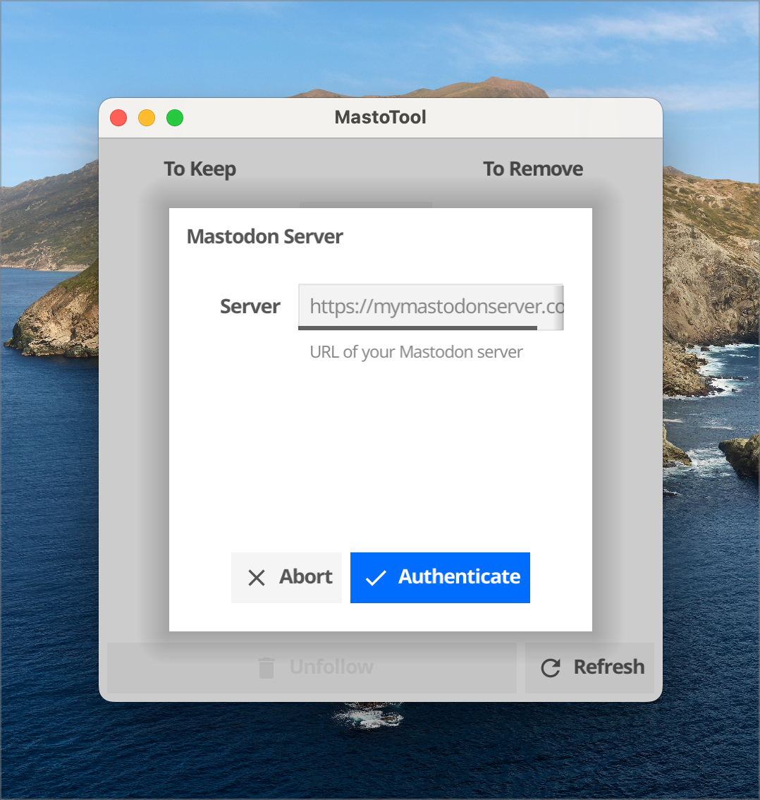
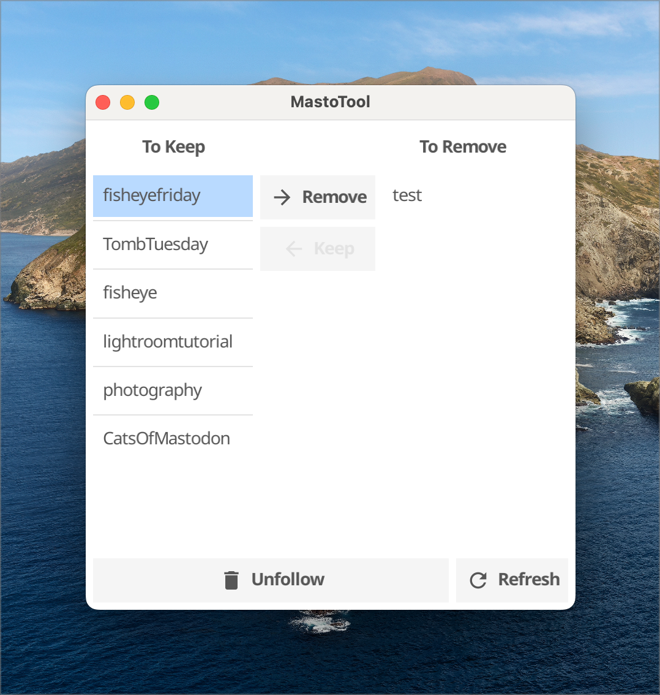

# MastoTool

Tools for managing your Mastodon account

## Motivation

When I first joined Mastodon, I got a little crazy subscribing to tags.
I quickly found myself inundated with toots that were not relevant.
The current Mastodon clients are not very good at allowing you to unsubscribe
from tags. I decided to write a GUI client that would allow me to quickly
unsubscribe and calm down my feed.

## Installation

Assuming you have a proper `go` environment, execute

`go run github.com/PaulWaldo/mastotool`.

You may also download binaries at [Releases · PaulWaldo/mastotool](https://github.com/PaulWaldo/mastotool/releases)

## Running

1. Once the program starts up, you will be asked which Mastodon server you want to work with:
   
   Selecting your server and tapping the _Authenticate_ button will open a web browser to your
   Mastodon server. Log in with your regular credentials and you will be given an authentication
   token. Copy this value and paste it into the next MastoTool dialog. Note that the token
   is stored so that you do not have to repeat this procedure.

1. Once you are authenticated, you will see a list of the tags you are following:
   
   For each tag you want to stop following, select it and tap the _Remove_ button.
   To change your mind on a specific tag, select it and tap the _Keep_ button.

1. Tap the _Unfollow_ button to call your Mastodon server to stop following all of
   the tags in the _To Remove_ column.

1. Optionally tap the _Refresh_ button to reload the list of followed tags from the
   server and reset your removal selection.

## Mea culpa

In an unfortunate turn of events, it turns out the the name `mastotool` is already taken
by <https://github.com/muesli/mastotool>. While both applications work in the same general
space, they should not be construed to have any relationship to each other.
If this becomes a problem, I'll be happy to rename my tool.  Appologies [muesli](https://github.com/muesli)!
